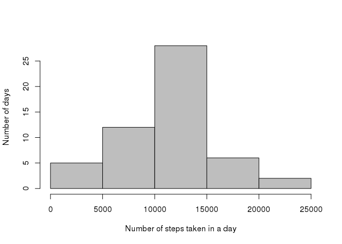
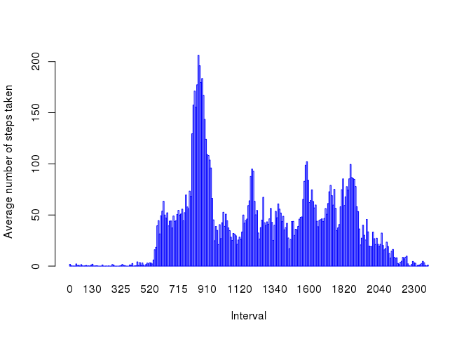
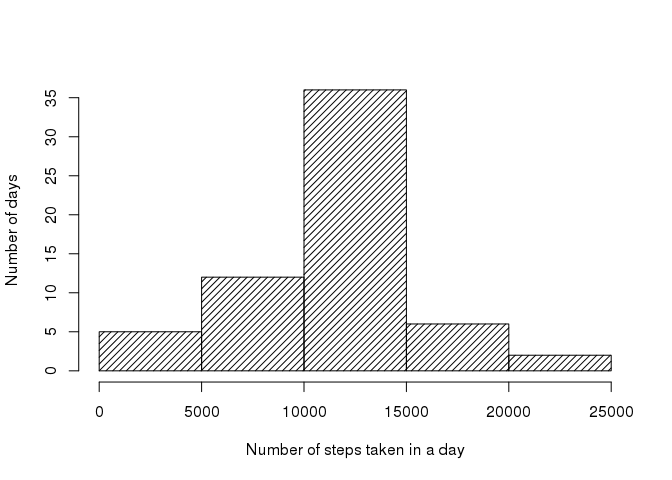
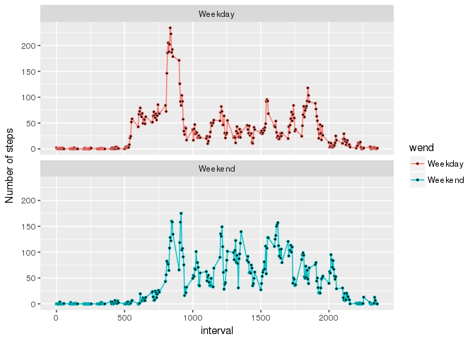

# PA1_template.Rmd

Reproducible Research - Project 1
===================================

<br>

Aim : To analyse the daily activity pattern of an individual.

Dataset: 'Activity monitoring data' that is collected from wearable devices that monitor body movements. The device collects data at 5 minute intervals through out the day. The data consists of two months of data from an anonymous individual collected during the months of October and November, 2012 and include the number of steps taken in 5 minute intervals each day.


### 1. Loading the data and excluding missing values


```r
knitr::opts_chunk$set(echo = TRUE)
activity_ori<- read.table(file = "./project1/activity.csv",header = TRUE,sep = ",",na.strings = "NA")
activity <- na.omit(activity_ori)
```
$~$

### 2. Histogram of total steps in a day 


```r
totstepsaday <- tapply(activity$steps,activity$date,sum)
hist(totstepsaday,xlab = "Number of steps taken in a day",
                  ylab = "Number of days",main = "",
                  col = "grey" )
```

<!-- -->
$~$


### 3. Mean and median number of steps taken each day


```r
mean(totstepsaday,na.rm = T)
```

```
## [1] 10766.19
```

```r
median(totstepsaday,na.rm = T)
```

```
## [1] 10765
```
$~$


### 4. Time series plot


```r
timeseries <- tapply(activity$steps,activity$interval,mean)
barplot(timeseries,xlab = "Interval",
                   ylab = "Average number of steps taken",
                   col = "white",
                   border = "blue")
```

<!-- -->
$~$


### 5. Interval of maximum steps


```r
timeseries[which(timeseries == max(timeseries))]
```

```
##      835 
## 206.1698
```
$~$

It is between 8.30am and 8.35am that the individual takes maximum number of
steps on average.

$~$

### 6. Imputing missing values


```r
activity_imp <- activity_ori
activity_imp[is.na(activity_ori)] <- round(mean(timeseries))
```
$~$


### 7. Histogram of total steps in a day - after imputing


```r
totstepsaday_imp <- tapply(activity_imp$steps,activity_imp$date,sum)
hist(totstepsaday_imp,xlab = "Number of steps taken in a day",
                      ylab = "Number of days",main = "",
                      col = "black",
                      density = 20)
```

<!-- -->
$~$


### 8. Comparing weekday and weekend


```r
activity$date <- as.Date(activity$date)
activity$wend <- as.factor(ifelse(weekdays(activity$date) %in% c("Sunday","Saturday"),"Weekend","Weekday"))
timeseries2 <- aggregate(activity$steps,list(interval=activity$interval,wend=activity$wend),mean)
library(ggplot2)
ggplot(data=timeseries2,aes(x=interval,y=x,group=wend,color=wend)) + 
       geom_line() + geom_point( size=1, shape=21, fill="black") +
       facet_wrap("wend",nrow = 2) +
       labs(y="Number of steps",x="interval")
```

<!-- -->
$~$

On average, total steps on weekend days (12406) is more than that on weekdays(10177).


